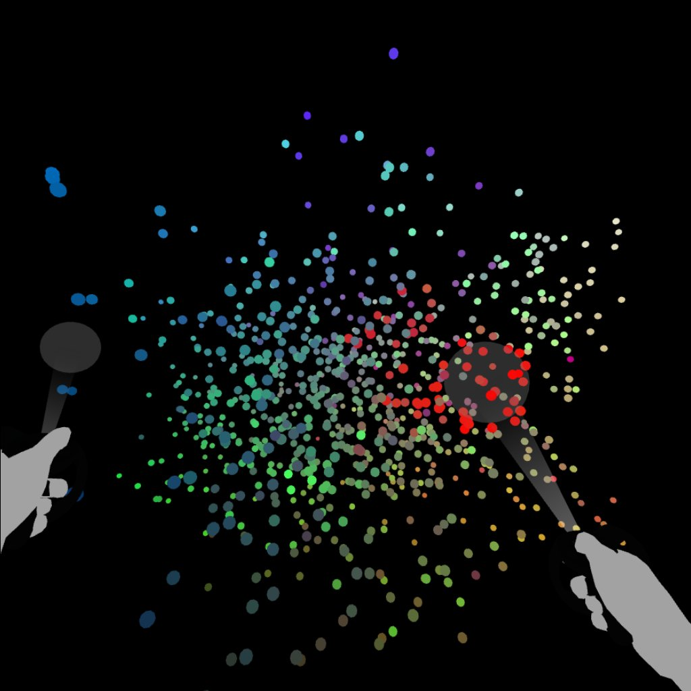

# TimbreSpaceVR

TimbreSpace VR is a granular synthesis application which visualizes the abstract concept of timbre in three-dimensional space.  

36 different features are extracted from discrete audio events called grains, and are plotted in various combinations in 3D space for the user to interact with in real time.

